# Brainlike-learning-system-for-MNist

认知神经科学作业，模拟人脑神经元进行学习

## 任务说明

1. 认真学习并调研生物神经元信息传递机制；
2.  思考并设计学习方法实现正向信号传播的神经网络模型，通过学习（训练带标签数据）获得记忆（网络神经元间的权重），并使用预测新的数据来验证学习和记忆的效果。

## 我们的实验

经我们调研与讨论，我们选择了3种模型作为正向传播模型的选择，分别是基于：

- [自组织特征映射网](https://github.com/Robin-WZQ/Brainlike-learning-system-for-MNist/tree/main/ANN%2BSOM)
- [进化计算](https://github.com/Robin-WZQ/Brainlike-learning-system-for-MNist/tree/main/进化计算)
- [动态路由算法](https://github.com/Robin-WZQ/Brainlike-learning-system-for-MNist/tree/main/CapsuleNet%2BSom)

## 方案一：

### 1.1 前提假设

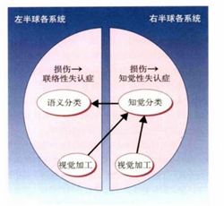

由于人类在进行物体识别时，首先经过两侧枕叶进行简单的特征提取，包括对各个方向的线段进行检测和神经兴奋。那么我们能否假设，人类具备的这种特征提取的功能是已经被编辑在基因之中的，也就是说，当一个从来没见过光明的失明患者，突然复明了，结果并不是需要从头开始训练特征感知器，而是只需要学习物体的种类。因此，输入的图片就经过特征提取（基因编辑好的）、知觉分类（此时并不知道它的名称）以及语义分类后确定分类结果。

### 1.2 生物学基础

神经生物学研究表明，不同的感觉输入（运动，视觉，听觉等）以有序的方式映射到大脑皮层的相应区域。

这种映射我们称之为拓扑映射，它具有两个重要特性：

1. 在表示或处理的每个阶段，每一条传入的信息都保存在适当的上下文（相邻节点）中。

2. 处理密切相关的信息的神经元之间保持密切，以便它们可以通过短突触连接进行交互。

我们的目标是建立人工的拓扑映射，以神经生物学激励的方式通过自组织进行学习。我们将遵循拓扑映射形成的原则：“拓扑映射中输出层神经元的空间位置对应于输入空间的特定域或特征”。

### 1.3 模型结构

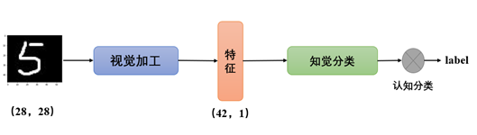

模型结构如图所示。根据以上假设，先利用BP算法对ANN网络的提取特征部分进行训练，将每一个图像归约到一个N维的特征空间中进行表示（**视觉加工**阶段，即提取特征），之后利用SOM网络对特征进行学习并分为10类（**知觉分类**阶段，即感知到它与其他类别不同）。同时，由于网络属于“无监督”算法，最终网络预测的结果无法和label匹配，所以需要转换函数的设置（**语义分类**阶段，即最终确定它是什么）。为了后续模型的迁移，我们将模型权重保存为npy文件，随时可进行调用。并设置多个epoch进行迭代，以此期望得到更好的结果。

### 1.4 实验

- 实验设置

**数据集** 本次所有实验均在MNIST数据集上执行，该数据集包含60000张训练样本和10000张测试样本，涉及数字0~9共10类。

- 实验方法

**ANN** 对于ANN网络，我们首先对权重进行正太分初始化，其均值为0，方差为0.01。我们共训练了10轮，batchsize为64. 其学习率大小设置为0.0005*batchsize。我们利用SGD作为优化器，考虑到数据比较简单，并未设置动量和权重衰减。

**SOM** 对于SOM网络，权重为随机初始化[1-,1]之间的数。我们对网络训练10轮，由于该模型无法进行批量更新，所以batchsize设置为5000。

- 实验结果

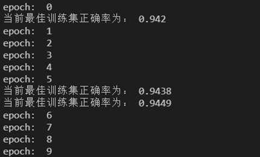

从最终结果看，通过特征提取器+SOM网络最终得到了较好的学习效果。

- 消融实验

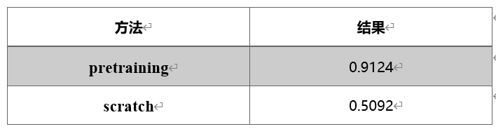

这里的特征继承的思想和预训练模型本质上一样，只不过思考角度不同，所以称之为“pretraining”。这里，我们对比了未进行特征提取的SOM网络（输入维度为28*28），与我们的模型的结果区别，每个模型都相继执行了10次，取均值作为评测结果。我们观察到：仅仅使用SOM网络只能得到51%左右的测试正确率，证明特征器能够给网络带来40%左右的提升。这也符合本模型设计的初衷，即以特征提取器当作视觉加工，而后以SOM为特征分类模型。

------

## 方案二：

进化计算训练神经网络，比较古老的优化手段，具体就看代码就行。

### 2.1 算法流程

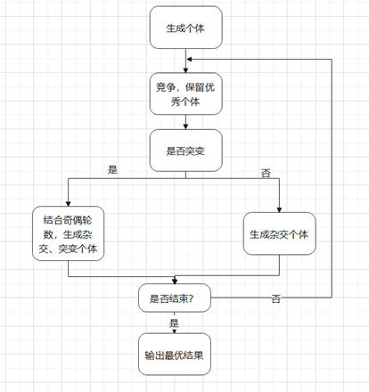

### 2.2 实验

- 实验结果

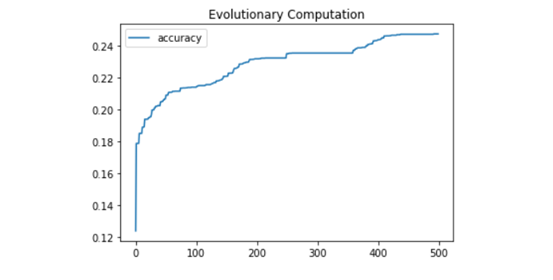

我们可以看到，准确率从0.12到0.25，有了近一倍的提升，虽然没有像普通BP算法那样，可以达到90%+的准确率，但一来我们使用的种群规模过小，加上限制了变异的幅度与规模，导致进化算法的探索范围不够大，其次进化算法的性能效果应该近似指数函数，再慢慢收敛，由于初始平均准确率只有0.07左右，（基本都是错误的权重网络），导致模型的优化提升较慢。

------

## 方案三：

### 3.1 生物学基础

给几张自由女神像的图片，尽管所有的图像显示的角度都不一样，人依然可以轻易识别出来这是自由女神像。即使从没有见过和这些一模一样的图片，但你仍然能立刻知道这是自由女神像。眼睛接收视觉信息，让大脑对周围世界的有分层的理解，并将其与已经学习的模式和关系相匹配。这就是人的视觉识别：**大脑中物体的表示与视角变换无关**。

### 3.2 理论基础

- CNN

CNN中高级特征将低级特征组合为加权和：前一层的激活乘以下一层神经元的权重并相加，然后传递给激活非线性，构成更高级别特征的更简单特征之间没有姿势（平移和旋转）关系。CNN 解决方法是使用max pooling或连续卷积来减少流经网络的数据的空间大小，从而增加更高层神经元的“感受野”。但最大池化仍然会丢失有价值的信息：简单和复杂对象之间的**重要空间层次结构**。

为了学会区分数字，人脑只需要看到几十个例子，最多几百个。而CNN 需要数以万计的样本才能获得非常好的性能，显然不如大脑。

如何在神经网络中对层次关系进行建模？3D对象之间的关系可以用姿势来表示，其本质是[平移](https://en.wikipedia.org/wiki/Translation_(geometry))加[旋转](https://en.wikipedia.org/wiki/Rotation_(mathematics))。当这些关系被构建到数据的内部表示中时，模型很容易理解它看到的东西只是它以前看到的东西的另一个视图。这就引出胶囊神经元（capsule）。 

- 胶囊神经元

训练人工神经元（neuron）可以用3个步骤概括：输入标量的标量加权；加权输入标量之和；标量到标量非线性。而胶囊除了输入仿射变换外还有：输入向量的矩阵乘法；输入向量的标量加权；输入向量加权求和；向量到向量的非线性。

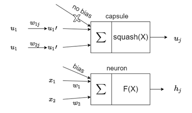

胶囊接收的输入向量（图中的u1、u2 ）来自下层中的其他2个胶囊。这些向量的长度编码了较低级别的胶囊检测到它们对应的对象的概率，向量的方向编码了检测到的对象的一些内部状态。然后将这些向量乘以相应的权重矩阵  ，该权重矩阵编码低级别特征（与高级别特征之间）的重要空间关系和其他关系。胶囊的输出向量的长度被解释为该胶囊已被训练检测的特征的存在概率。输出向量的方向是特征的参数化状态。所以，从某种意义上说，对于每个较低级别的胶囊 一世, 它的权重  定义其输出属于每个更高级别胶囊的概率分布  。在ANN中权重是在反向传播期间学习的，但在胶囊神经元里，权重是使用“动态路由算法”确定的。

- 动态路由算法

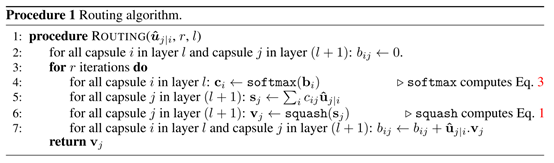

核心步骤：通过胶囊j的输出$V_i$与预测向量的点积加原有的权重作为新的权重值。点积处理为了检测胶囊输入与输出的相似性。更新权重后，进行下一轮迭代。

- squash非线性激活函数

接受一个向量，然后“挤压”它使其长度不超过 1，但不改变其方向。

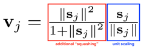

方程的右侧（蓝色矩形）缩放输入向量，使其具有单位长度，左侧（红色矩形）执行额外的缩放。输出向量长度为胶囊检测到给定特征的概率。

### 3.3 实验

- 实验结果

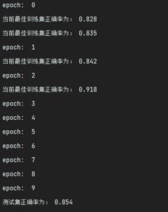

由于特征提取网络部分计算量是实验一（MLP+SGD）的几十倍，导致运行一个epoch需要30分钟左右，对于调参十分不友好。不过可以看到随着训练，模型的能力稳步提升。至于动态路由算法效果不如传统BP特征提取算法，一方面可能没有充分调参，一方面可能因为MNIST数据集当中完全旋转关系或者平移关系的图像不多，该特征一定程度上比较冗余，如果是对于更加复杂的真实的数据集识别、分类，想必会有更加优异的效果。

- 消融实验

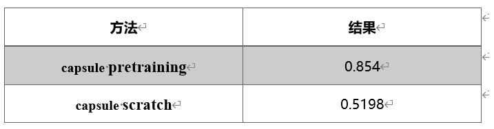

与实验一相同，我们对比了未进行特征提取的SOM网络与我们的模型的结果，执行10次取均值评测。观察到：仅使用SOM网络只能得到52%左右的测试正确率，胶囊网络+动态路由算法能够给网络带来34%左右的提升。

------

## 总结

本实验的方案一和方案三，是我们对Warrington**物体识别两阶段模型**进行模拟，构建特征提取器+SOM网络。特征器提取旨在较好的提取图像的特征，前者通过反向传播完成，并以此当作基因继承；后者则使用胶囊网络+动态路由算法训练，此处模拟的是**人脑识别物体时对物体视角变化的鲁棒**。随后将映射至42维的模型用SOM网络+转换函数进行分类，那么此处模拟的是人脑中**竞争与合作**等机制。方案一和方案三在MNIST数据集上达到了训练正确率和测试正确率分别达到0.94/0.91和0.91/0.84。方案三对数据集中存在大量空间平移旋转的情况更鲁棒，但在MNIST数据集当中可能反而是冗余特征；方案一获得了接近反向传播的MLP的优异效果。

方案二利用numpy生成随机权重矩阵，通过使用遗传算法与突变算法模拟人脑神经元进化。尽管其准确率有了近一倍的提升，但只有25%，分析可能由于种群规模过小、限制了变异的幅度与规模所导致进化算法探索范围不够大、进化算法的性能效果应该近似指数函数收敛较慢、初始平均准确率只有0.07左右，优化提升较慢。

## 展望

经讨论，我们提出了一种关于方案二的改进办法，即将进化计算的思路只用于特征器的训练。假设：古老生物最开始拥有的视觉特征提取器很差，感知大部分还是通过其他感官完成的。但是通过生物进化这一数亿年的修正之后，拥有了目前生物所拥有的特征提取功能。因此，将遗传算法部分的输出特征接到SOM网络中，以该网络的分类结果表征特征器效果，以此作为指示变量进行进化。但是由于计算量巨大（一次SOM网络7分钟*20个个体=140分钟），即光进行一代就要200分钟，而进化至少需要数百代，所以这部分的实验没能完成，但是我们都认为这个想法很有讨论价值，故放至此。
